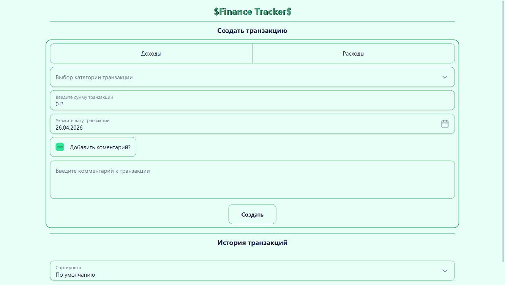

# 💰 Finance Tracker

> Простое приложение для учёта личных финансов. Добавляйте доходы и расходы, просматривайте историю транзакций с drag‑and‑drop, данные сохраняются в `localStorage`.



## 🚀 Демо

> 🚧 **В разработке** – демо-версия появится позже.

## 📦 Стек технологий

| Категория         | Технологии             |
| ----------------- | ---------------------- |
| Язык / фреймворк  | Angular 17, TypeScript |
| Сборка / монорепа | Nx                     |
| UI‑библиотека     | Taiga UI 3.117.0       |
| Стили             | Less                   |
| Реактивность      | RxJS                   |
| Хранение данных   | `localStorage`         |

## ✨ Основные возможности

### 📝 Форма добавления транзакции

- Выбор типа **Доход / Расход** (обязательно)
- **Категория** – динамический список (разный для доходов и расходов)
- **Сумма** – только цифры, валидация от 0 до 10 000 000
- **Дата** – выбор даты (запрещены будущие даты)
- **Комментарий** – опционально, с чекбоксом:
  - активен → поле становится обязательным, максимум 100 символов
  - снят → валидаторы очищаются (кастомная директива)
- Валидация всех полей с уникальными сообщениями об ошибках
- Успешная отправка → алерт, форма сбрасывается

### 📜 История транзакций

- Плитки с категорией, суммой, датой (комментарий по ховеру на иконку)
- **Drag & drop** – изменение порядка транзакций внутри блока
- Удаление транзакции по кнопке
- Сортировка по дате:
  - по умолчанию
  - по возрастанию
  - по убыванию
- **Адаптивность**:
  - экраны >850px – размер плитки зависит от суммы (чем больше сумма, тем крупнее блок)
  - экраны ≤850px – фиксированный размер, сетка подстраивает количество колонок
- Данные сохраняются в `localStorage` и восстанавливаются после перезагрузки

### 💰 Форматирование суммы (кастомный пайп)

- Знак «+» для доходов, «–» для расходов
- Разбивка целой части на разряды пробелами
- Дробная часть отделяется запятой
- Символ валюты ₽

## 🛠️ Установка и запуск

```bash
git clone https://github.com/Sw1ftFox/finance-tracker.git
cd finance-tracker
npm install
npm start
```

## 📂 Структура проекта (основные модули)

```
app/
├── components/               # UI‑компоненты (форма, история, поля ввода)
├── directives/               # Кастомная директива для валидации комментария
├── models/                   # Интерфейс транзакции
├── pipes/                    # Пайп форматирования суммы
├── services/                 # ApiService, TransactionService, Facade
├── utils/                    # Вспомогательные функции (дата, валидация, размеры, сортировка, storage)
├── app.component.*           # Корневой компонент
└── app.config.ts             # Конфигурация приложения
```
